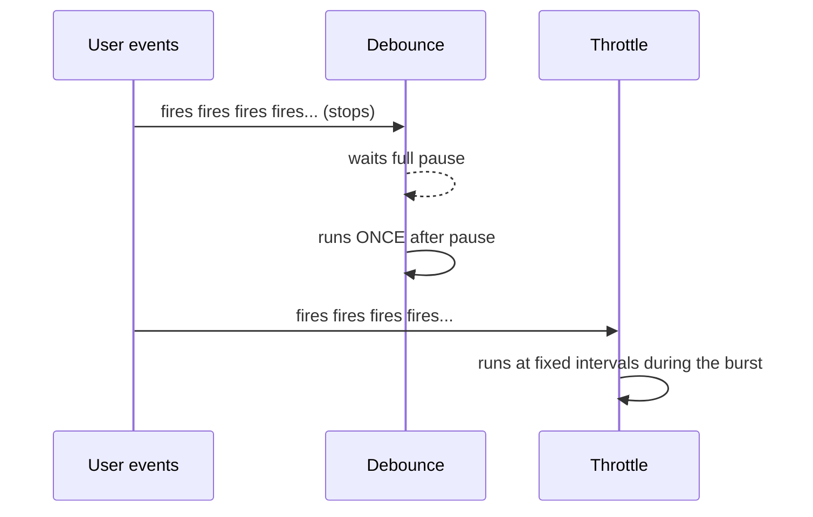

# Debounce vs Throttle

## Concept
Both are techniques to **limit how often a function runs** in response to
frequent events (typing, scrolling, resizing). They limit it differently:

- **Debounce** — wait until the events *stop* for a pause, then run once.
- **Throttle** — run at most once every fixed interval, no matter how often
  the event fires.

## Why it matters
Directly relevant to your stack — React search inputs, infinite scroll,
window resize handlers, and React Native scroll/gesture events all need one
of these to avoid firing expensive work (API calls, re-renders) dozens of
times per second.



## How it works

**Debounce — real-world example: search-as-you-type**

```js
function debounce(fn, delay) {
  let timerId;
  return function (...args) {
    clearTimeout(timerId); // cancel the previous pending call
    timerId = setTimeout(() => fn.apply(this, args), delay);
  };
}

const search = debounce((query) => {
  console.log("Calling API with:", query);
}, 500);

// User types "react" fast — each keystroke calls search()
// but the API call only fires ONCE, 500ms after the LAST keystroke
searchInput.addEventListener("input", (e) => search(e.target.value));
```

**Throttle — real-world example: scroll position tracking**

```js
function throttle(fn, limit) {
  let inThrottle = false;
  return function (...args) {
    if (!inThrottle) {
      fn.apply(this, args);
      inThrottle = true;
      setTimeout(() => (inThrottle = false), limit);
    }
  };
}

const logScroll = throttle(() => {
  console.log("Scroll position:", window.scrollY);
}, 200);

// Fires on every scroll pixel, but logScroll only actually
// runs at most once every 200ms during continuous scrolling
window.addEventListener("scroll", logScroll);
```

## Common interview questions
- Difference between debounce and throttle — give a real use case for each.
- Implement debounce from scratch.
- Implement throttle from scratch.
- Why would a search input use debounce but a scroll handler use throttle?
- What would happen if you used throttle for a search box instead of debounce?
  (You'd still fire API calls mid-typing instead of waiting for the user to finish.)

!!! tip "Gotchas / follow-ups"
    - `lodash` provides battle-tested `_.debounce` and `_.throttle` — mention
      you'd reach for those in production rather than hand-rolling, unless asked to implement it live.
    - In React, debounce/throttle functions should typically be memoized
      (`useMemo`/`useCallback` or created once via `useRef`) so a new debounced
      function isn't recreated (and its timer reset) on every render.
    - "Leading edge" vs "trailing edge" debounce is a common follow-up —
      whether the first call fires immediately or only after the pause.

## Personal example
_(Add a real case — e.g. debouncing a search bar in a React app to cut API
calls, or throttling an `onScroll` handler in a React Native list to keep
scroll performance smooth.)_

## Related
- [Closures](closures.md) — both implementations rely on closures to keep track of the timer.
- [Event Loop](event-loop.md)
