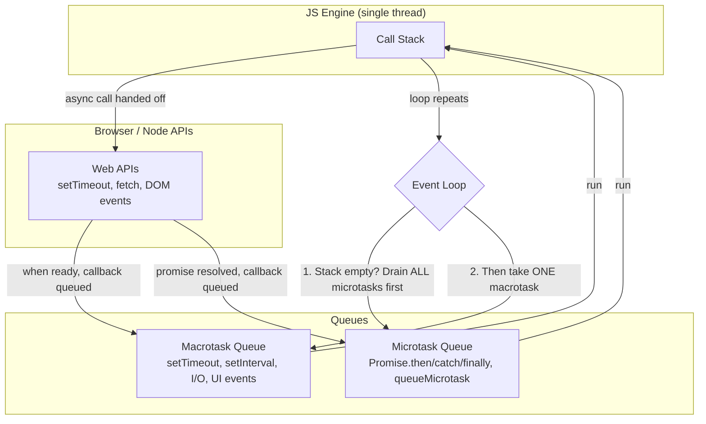

# Event Loop

## Concept
JavaScript is **single-threaded** — it can only do one thing at a time. The
Event Loop is the mechanism that lets JS handle async operations (timers,
network calls, DOM events) without blocking that single thread, by
coordinating several moving parts: the **Call Stack**, **Web APIs**, the
**Microtask Queue**, and the **Callback (Macrotask) Queue**.

## Why it matters
Almost every "what's the output order?" interview question is really testing
whether you understand the event loop. It also explains real production
issues — e.g. why a `Promise.then()` always runs before a `setTimeout(fn, 0)`,
or why a long synchronous loop freezes the UI in React/React Native.

## The components



- **Call Stack** — where synchronous code actually executes, one frame at a time.
- **Web APIs** (browser) / **libuv** (Node) — where async work (timers, network,
  file I/O) actually happens *outside* the JS thread.
- **Microtask Queue** — holds `Promise` callbacks (`.then`, `.catch`, `.finally`)
  and `queueMicrotask()`. **Highest priority.**
- **Macrotask Queue** — holds `setTimeout`, `setInterval`, I/O callbacks, UI
  rendering, DOM events. Lower priority.
- **Event Loop** — the coordinator. Its rule, every single cycle:
  1. Run the Call Stack until it's empty.
  2. Drain the **entire** microtask queue (even if new microtasks keep getting
     added during draining — it doesn't stop until the queue is truly empty).
  3. Take exactly **one** task from the macrotask queue, run it.
  4. Repeat from step 2.

## Line-by-line code walkthrough

```js
console.log("1");                                   // line A

setTimeout(() => console.log("2"), 0);               // line B

Promise.resolve().then(() => console.log("3"));       // line C

console.log("4");                                    // line D

// Output: 1, 4, 3, 2
```

**Line-by-line trace:**

1. `console.log("1")` (line A) — runs immediately on the call stack → prints `1`.
2. `setTimeout(...)` (line B) — the callback `() => console.log("2")` is handed
   off to the Web API. Even with a `0`ms delay, it doesn't run now — it's
   scheduled and placed into the **macrotask queue** once the timer (0ms) expires.
3. `Promise.resolve().then(...)` (line C) — the promise is already resolved, so
   its `.then` callback is placed into the **microtask queue** immediately.
4. `console.log("4")` (line D) — runs immediately on the call stack → prints `4`.
5. Call stack is now empty. Event loop checks the **microtask queue first** —
   finds the `.then` callback from step 3 → runs it → prints `3`.
6. Microtask queue is now empty. Event loop moves to the **macrotask queue** —
   finds the `setTimeout` callback from step 2 → runs it → prints `2`.

Final output order: **1, 4, 3, 2** — even though `setTimeout` was scheduled
before the promise, the microtask always wins because it has higher priority.

## A trickier example (microtask starvation)

```js
console.log("start");

setTimeout(() => console.log("timeout"), 0);

Promise.resolve().then(() => {
  console.log("promise 1");
  Promise.resolve().then(() => console.log("promise 2")); // queues ANOTHER microtask
});

console.log("end");

// Output: start, end, promise 1, promise 2, timeout
```

Even though "promise 2" is queued *during* the draining of the microtask
queue, the event loop doesn't move to the macrotask queue until microtasks
are **completely** empty — so "promise 2" still beats "timeout."

## Common interview questions
- Explain the event loop and its components.
- Why does a `Promise.then()` run before `setTimeout(fn, 0)`?
- What's the difference between a microtask and a macrotask? Give examples of each.
- What happens if you keep adding microtasks inside a microtask — can it starve macrotasks?
- Predict the output of a mixed `console.log`/`setTimeout`/`Promise` snippet (very common — practice several).
- How does the event loop relate to why long synchronous code "freezes" the UI?

!!! tip "Gotchas / follow-ups"
    - `async/await` is just syntax sugar over promises — `await` pauses the
      function and schedules the rest as a microtask, same priority as `.then()`.
    - Node.js has additional queue types (`process.nextTick`, which runs even
      before other microtasks) — worth mentioning if the interview is Node-specific.
    - `requestAnimationFrame` is neither a microtask nor a regular macrotask —
      it runs before the next repaint, a separate concept worth knowing for frontend roles.
    - In React Native, the JS thread and the Native/UI thread are separate —
      the event loop only governs the JS thread; heavy JS work still blocks
      JS-driven UI updates (a common RN performance interview follow-up).

## Personal example
_(Add a real case — e.g. debugging a race condition where a state update from
a `setTimeout` ran after an expected `Promise` chain, or a React Native
performance issue traced back to blocking the JS thread with a synchronous loop.)_

## Related
- [Promises](promises.md)
- [Async/Await vs Promises](async-await-vs-promises.md)
