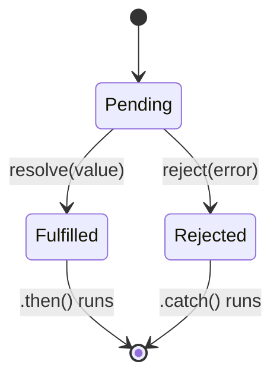

# Promises

## Concept
A `Promise` is an object representing the eventual result (or failure) of an
async operation. It's a cleaner alternative to nested callbacks ("callback hell"),
with a defined state machine: **pending → fulfilled** or **pending → rejected**.

## Why it matters
Nearly all async work in modern JS — API calls (`fetch`, `axios`), file reads,
timers wrapped for async use — is Promise-based. React data fetching,
Spring Boot API calls from the frontend, and `async/await` all sit on top of Promises.

## How it works



A promise has exactly one of three states, and once it leaves `pending`, it's
**settled** — it can never change state again.

```js
const promise = new Promise((resolve, reject) => {
  const success = true;
  setTimeout(() => {
    if (success) resolve("Data loaded");
    else reject(new Error("Failed to load"));
  }, 1000);
});

promise
  .then((result) => console.log(result))   // runs if resolved
  .catch((err) => console.error(err))      // runs if rejected
  .finally(() => console.log("Done"));      // always runs
```

**Chaining** — each `.then()` returns a new promise, letting you sequence async steps:

```js
fetch("/api/user/1")
  .then((res) => res.json())          // returns a new promise
  .then((user) => fetch(`/api/orders/${user.id}`))
  .then((res) => res.json())
  .then((orders) => console.log(orders))
  .catch((err) => console.error("Something in the chain failed:", err));
// A single .catch() at the end catches errors from ANY step above it.
```

**Combinators — running multiple promises together:**

```js
// Promise.all — waits for ALL to succeed; fails fast if ANY rejects
Promise.all([fetchUser(), fetchOrders(), fetchPayments()])
  .then(([user, orders, payments]) => console.log(user, orders, payments))
  .catch((err) => console.error("At least one failed:", err));

// Promise.allSettled — waits for ALL, never short-circuits, gives status of each
Promise.allSettled([fetchUser(), fetchOrders()])
  .then((results) => results.forEach((r) => console.log(r.status, r.value ?? r.reason)));

// Promise.race — resolves/rejects as soon as the FIRST one settles
Promise.race([fetchData(), timeout(5000)]) // classic pattern for request timeouts
  .then((result) => console.log(result))
  .catch((err) => console.error("Lost the race:", err));

// Promise.any — resolves as soon as the FIRST one fulfills, ignores rejections
// unless ALL reject
Promise.any([fetchFromMirror1(), fetchFromMirror2()])
  .then((firstSuccess) => console.log(firstSuccess));
```

## Common interview questions
- What are the three states of a Promise?
- Difference between `Promise.all`, `allSettled`, `race`, and `any`?
- How do you handle errors in a promise chain?
- What happens if you throw inside a `.then()`?
- Can a promise resolve/reject more than once? Why not?
- How would you implement a `timeout` wrapper around a fetch call using `Promise.race`?

```js
function fetchWithTimeout(url, ms) {
  const timeout = new Promise((_, reject) =>
    setTimeout(() => reject(new Error("Request timed out")), ms)
  );
  return Promise.race([fetch(url), timeout]);
}
```

!!! tip "Gotchas / follow-ups"
    - Throwing inside a `.then()` is caught by the next `.catch()` in the chain —
      errors propagate down the chain just like exceptions.
    - Forgetting to `return` a promise inside a `.then()` breaks chaining — the
      next `.then()` runs immediately instead of waiting.
    - `Promise.all` fails fast on the first rejection — use `allSettled` when
      you need every result regardless of individual failures.
    - A promise's callback (`.then`) is always a **microtask** — see [Event Loop](event-loop.md).

## Personal example
_(Add a real case — e.g. using `Promise.all` to parallelize multiple API calls
on a dashboard screen instead of awaiting them sequentially, and the load-time
improvement it gave.)_

## Related
- [Event Loop](event-loop.md)
- [Async/Await vs Promises](async-await-vs-promises.md)
