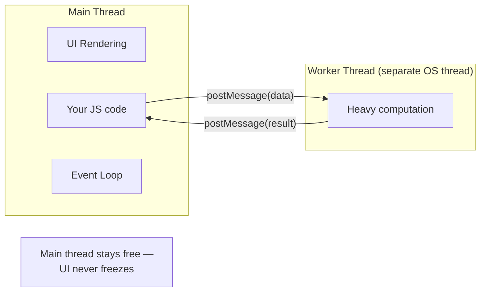

# Web Workers — How JS Handles True Parallelism

## Concept
JS is single-threaded — the event loop gives the *illusion* of concurrency
for I/O (network, timers), but CPU-heavy synchronous code still blocks
everything, including UI rendering. **Web Workers** run JS on a genuinely
separate OS thread, giving real parallelism for expensive computation.

## Why it matters
The event loop (async/await, promises, setTimeout) does **not** help with
CPU-bound work — a heavy synchronous loop (image processing, large sorts,
parsing huge JSON) still freezes the UI no matter how it's wrapped in a
promise. Workers are the actual fix, and knowing the difference between
"async" and "parallel" is a favorite senior-level follow-up question.



## How it works

**main.js:**

```js
const worker = new Worker("worker.js");

worker.postMessage({ command: "start", numbers: [1, 2, 3, /* ...huge array */] });

worker.onmessage = (event) => {
  console.log("Result from worker:", event.data);
};

worker.onerror = (err) => {
  console.error("Worker error:", err.message);
};

// Main thread is FREE the whole time — UI stays responsive
console.log("This logs immediately, without waiting for the worker");
```

**worker.js (runs on a separate thread):**

```js
self.onmessage = (event) => {
  const { numbers } = event.data;

  // Expensive CPU-bound work — would freeze the UI if run on the main thread
  const result = numbers.reduce((sum, n) => sum + expensiveCalculation(n), 0);

  self.postMessage(result);
};

function expensiveCalculation(n) {
  let total = 0;
  for (let i = 0; i < 1e7; i++) total += Math.sqrt(n * i);
  return total;
}
```

**Key constraint:** workers **cannot** touch the DOM, `window`, or share
memory directly with the main thread. Communication only happens via
`postMessage()` (data is cloned, not shared — unless using `SharedArrayBuffer`).

## Common interview questions
- Does `async/await` give you true parallelism? Why or why not?
- What's the difference between concurrency (event loop) and parallelism (Web Workers)?
- Why can't a Web Worker touch the DOM?
- When would you actually reach for a Web Worker in a real app?
  (Image/video processing, large data parsing/sorting, complex calculations,
  encryption — anything CPU-heavy that would otherwise jank the UI.)
- What is `SharedArrayBuffer`, briefly? (Allows true shared memory between
  main thread and worker, avoiding the clone-on-message-pass overhead —
  advanced, usually just needs a one-line mention.)

!!! tip "Gotchas / follow-ups"
    - This question is often asked right after Event Loop — the "gotcha" is
      realizing promises/async don't solve CPU-bound blocking at all, only I/O-bound waiting.
    - React Native has an equivalent concern: heavy JS work blocks the JS
      thread, which can make gesture/animation responses feel janky — same
      root problem (single JS thread), different environment. Native modules
      or the New Architecture's JSI help here instead of literal Web Workers.
    - Data passed via `postMessage` is cloned (structured clone algorithm) —
      functions, DOM nodes, and some object types can't be passed.

## Personal example
_(Add a real case — e.g. offloading a large CSV/JSON parse-and-transform step
to a worker to keep a React dashboard from freezing during upload, or a
discussion of why a heavy synchronous filter on a big list janked scrolling
in a React Native screen.)_

## Related
- [Event Loop](event-loop.md)
