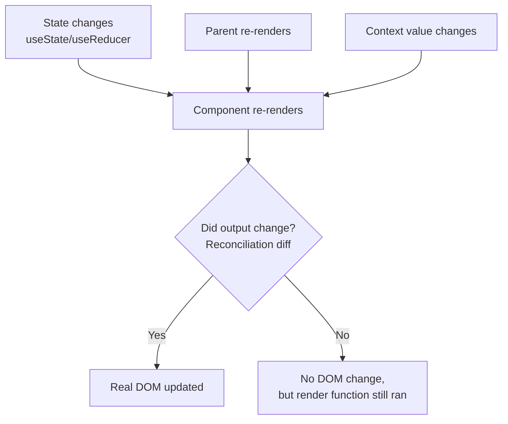

# React Re-renders & Performance

## Concept
A re-render happens when a component's state changes, its parent re-renders
(causing all children to re-render by default), or its context value changes.
Re-rendering itself isn't inherently bad — the Virtual DOM diff is cheap —
but **unnecessary** re-renders at scale (large lists, deep trees) cause real
jank.

## Why it matters
This is where all the previous React topics converge — reconciliation,
`useMemo`/`useCallback`, `key` props, and Context all exist to control *when*
and *how much* re-rendering happens. It's the most common "why is my app slow"
interview + real-world debugging category.

## What triggers a re-render



**Key insight:** "re-render" means the component function ran again and React
diffed its output — it does **not** automatically mean the DOM changed. But
running the function itself still costs CPU time, which matters at scale.

## `React.memo` — skip re-rendering if props haven't changed

```jsx
const ExpensiveRow = React.memo(function ExpensiveRow({ item }) {
  console.log("Rendering row:", item.id);
  return <li>{item.name}</li>;
});

function List({ items }) {
  const [count, setCount] = useState(0); // unrelated state

  return (
    <>
      <button onClick={() => setCount(count + 1)}>Count: {count}</button>
      {/* WITHOUT React.memo: every row re-renders when count changes, even
          though 'items' never changed */}
      {items.map((item) => <ExpensiveRow key={item.id} item={item} />)}
    </>
  );
}
```

`React.memo` does a **shallow comparison** of props — it breaks silently if
you pass a new object/array/function reference every render (see
[useMemo vs useCallback](usememo-vs-usecallback.md) for the fix).

## The `key` prop pitfall (ties to reconciliation)

```jsx
// BAD: index as key on a reorderable/filterable list
{items.map((item, i) => <Row key={i} {...item} />)}
// Insert an item at position 0 → every row's "identity" shifts →
// React thinks every row changed → unnecessary re-renders,
// and worse: any internal state (e.g. an open/closed toggle) attaches
// to the wrong row after reordering.

// GOOD: stable, unique key
{items.map((item) => <Row key={item.id} {...item} />)}
```

## Common interview questions
- What actually triggers a component to re-render?
- Does a re-render always mean the DOM was updated? (No — see diagram above.)
- How does `React.memo` work, and why does it sometimes "not work"?
  (Non-memoized function/object props passed down break the shallow comparison.)
- Why is using array index as `key` risky for reorderable or filterable lists?
- How would you find and fix an unnecessary re-render in a real app?
  (React DevTools Profiler → "Highlight updates when components render" →
  identify the component → check props/context/state causing it → memoize appropriately.)

!!! tip "Gotchas / follow-ups"
    - Don't reach for `React.memo`/`useMemo`/`useCallback` everywhere by
      default — profile first. Premature memoization adds complexity and its
      own comparison overhead for little to no gain on cheap components.
    - Moving state **down** to the smallest component that needs it (state
      colocation) often eliminates re-render problems entirely, without any memoization.
    - Splitting a large context into smaller, more targeted contexts (see
      [Context vs Redux/Zustand](context-vs-redux-zustand.md)) is often a
      bigger performance win than memoizing individual components.

## Personal example
_(Add a real case — e.g. using the React DevTools Profiler to find a
600-row table re-rendering entirely on every keystroke in an unrelated
filter input, and fixing it with `React.memo` + `useCallback`.)_

## Related
- [Virtual DOM & Reconciliation](virtual-dom-reconciliation.md)
- [useMemo vs useCallback](usememo-vs-usecallback.md)
- [Context API vs Redux/Zustand](context-vs-redux-zustand.md)
