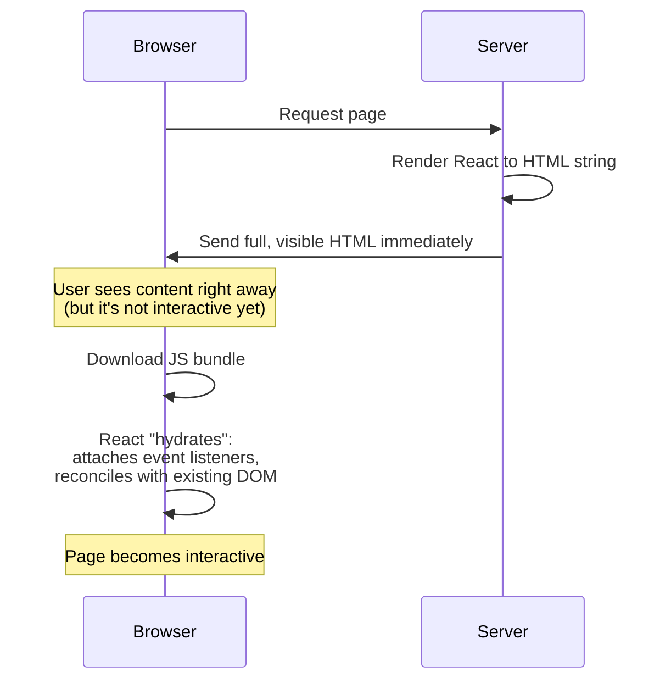

# Server-Side Rendering Basics (Hydration, Next.js Awareness)

## Concept
**Client-side rendering (CSR)** ships an almost-empty HTML shell and lets the
browser download, parse, and run JS to build the page. **Server-side
rendering (SSR)** renders the full HTML on the server first, sends a
complete page immediately, then **hydrates** it — React attaches event
listeners and takes over the already-rendered markup on the client.

## Why it matters
SSR directly affects perceived load time, SEO (crawlers see full content
immediately), and Core Web Vitals — real business metrics. Next.js is the
dominant React framework for this, and interviewers commonly ask you to
explain hydration precisely because it's a frequent source of production bugs.

## How it works



**CSR vs SSR vs Static Generation — quick comparison:**

| | CSR | SSR | Static (SSG) |
|---|---|---|---|
| HTML on first response | Empty shell | Fully rendered | Fully rendered (pre-built) |
| When rendering happens | In the browser, on every visit | On the server, per request | At build time, once |
| SEO | Poor (unless crawler executes JS) | Good | Good |
| Time to First Contentful Paint | Slower | Faster | Fastest |
| Good for | Dashboards, apps behind login | Dynamic, personalized pages | Blogs, marketing pages, docs |

**Hydration mismatch — a real, common bug:**

```jsx
// Server renders based on server's time; client hydrates with browser's time
// → mismatch, because the two don't agree on what the HTML should be
function Clock() {
  return <p>{new Date().toLocaleTimeString()}</p>;
}
// React logs: "Text content does not match server-rendered HTML"

// Fix: render a static placeholder on the server, compute the real value
// only after mount (client-only)
function Clock() {
  const [time, setTime] = useState(null);
  useEffect(() => setTime(new Date().toLocaleTimeString()), []);
  return <p>{time ?? "--:--:--"}</p>;
}
```

## Common interview questions
- What is hydration, and what problem does it solve?
- Difference between CSR, SSR, and Static Site Generation?
- What causes a "hydration mismatch" error, and how do you avoid it?
- Why is SSR generally better for SEO than pure CSR?
- What's Next.js's role here, at a high level? (A framework built on React
  that provides SSR/SSG/ISR out of the box, file-based routing, and API routes —
  handles the plumbing so you don't hand-roll a Node SSR server.)

!!! tip "Gotchas / follow-ups"
    - Common hydration mismatch sources: browser-only APIs (`window`,
      `localStorage`) accessed during render instead of in `useEffect`,
      non-deterministic values (`Date.now()`, `Math.random()`) used directly
      in the render output, and browser extensions injecting markup before hydration.
    - Next.js's App Router introduces **React Server Components** — components
      that render only on the server and send zero JS to the client — a
      distinct, newer concept worth a one-line mention if the interview goes deep on Next.js.
    - SSR isn't free — it shifts rendering cost onto your server, and adds
      complexity (needing a Node runtime, not just static file hosting).

## Personal example
_(Add a real case — e.g. fixing a hydration mismatch caused by conditionally
rendering based on `window.innerWidth` directly in the render body instead of after mount.)_

## Related
- [Suspense & Lazy Loading](suspense-and-lazy-loading.md)
