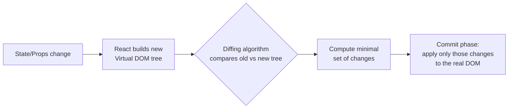

# Virtual DOM & Reconciliation

## Concept
The Virtual DOM is a lightweight JS object representation of the real DOM.
When state changes, React builds a new Virtual DOM tree, **diffs** it against
the previous one (reconciliation), and applies only the minimal set of real
DOM updates needed — instead of re-rendering the whole page.

## Why it matters
Direct DOM manipulation is slow (layout thrashing, reflows). Understanding
reconciliation explains *why* the `key` prop matters, why re-renders don't
mean "the whole DOM was rebuilt," and is the foundation for every React
performance question that follows.

## How it works



**The diffing heuristics React actually uses (not a generic tree-diff, which
would be O(n³) — React's is O(n) via these assumptions):**

1. **Different element types → tear down and rebuild.**
   ```jsx
   // Old: <div><Counter /></div>
   // New: <span><Counter /></span>
   // React destroys the whole subtree (including Counter's state) and rebuilds —
   // it doesn't try to diff div vs span's children.
   ```

2. **Same element type → keep the DOM node, update only changed attributes.**
   ```jsx
   // Old: <div className="a" title="old" />
   // New: <div className="b" title="old" />
   // React keeps the same DOM node, patches only className.
   ```

3. **Lists → the `key` prop tells React which items are the same across renders.**
   ```jsx
   // WITHOUT stable keys (using array index):
   {items.map((item, index) => <Item key={index} {...item} />)}
   // If an item is inserted at the top, EVERY index shifts, so React thinks
   // every single item changed — causes unnecessary re-renders, lost input
   // focus/state, and can corrupt uncontrolled input state in forms.

   // WITH stable keys:
   {items.map((item) => <Item key={item.id} {...item} />)}
   // React correctly matches items across renders by their real identity —
   // only the actually-new item triggers a DOM insertion.
   ```

## Common interview questions
- What is the Virtual DOM, and why is it faster than direct DOM manipulation?
- Explain React's reconciliation algorithm at a high level.
- Why does React need a `key` prop for lists, and why is array index a bad key?
- What happens if two sibling elements swap types between renders?
- Is the Virtual DOM always faster than direct DOM manipulation? (Not
  inherently — it's faster for the *general* case of complex, frequent
  updates; a hand-optimized direct DOM update for one known change can beat it.)

!!! tip "Gotchas / follow-ups"
    - Reconciliation happens in two phases: **render phase** (compute the diff,
      interruptible with Concurrent React) and **commit phase** (apply changes,
      synchronous, not interruptible).
    - `key` should be **stable, unique, and predictable** — never use
      `Math.random()` or array index if the list can reorder/filter/insert.
    - This topic is the foundation for [React re-renders & performance](rerenders-and-performance.md)
      — expect them to be asked back-to-back.

## Personal example
_(Add a real case — e.g. a bug where using array index as `key` caused input
fields in a dynamic form to show the wrong values after deleting a row.)_

## Related
- [React Re-renders & Performance](rerenders-and-performance.md)
- [useMemo vs useCallback](usememo-vs-usecallback.md)
