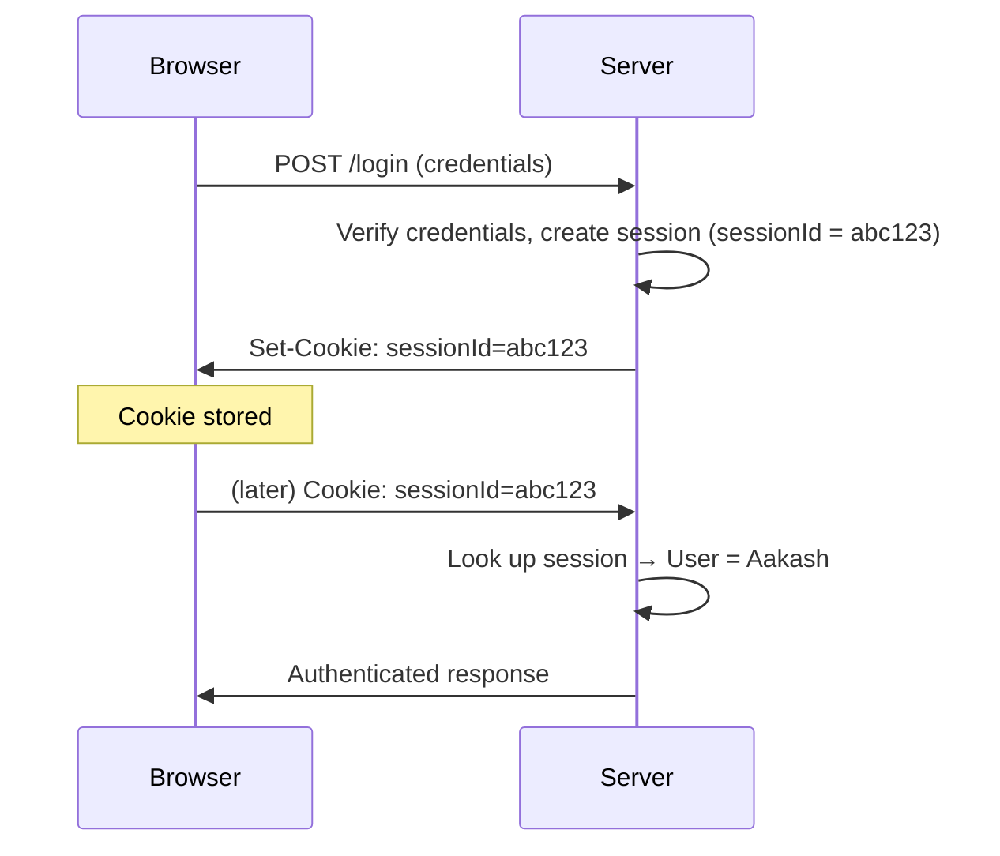

# Cookies, Sessions, JWT & Auth vs AuthZ

## Concept
Cookies are just a **browser-managed storage/transport mechanism** — not an
authentication strategy by themselves. Sessions and JWTs are two different
*authentication strategies* that commonly get carried inside a cookie.

## Why it matters
Mixing up "cookie," "session," and "JWT" as if they're interchangeable is a
very common confusion — and a red flag in interviews, since these are three
genuinely distinct concepts that happen to be used together in practice.

## Cookies

```
Server responds:
Set-Cookie: sessionId=abc123
      │
      ▼
Browser stores it
      │
      ▼
On later matching requests, browser automatically sends:
Cookie: sessionId=abc123
```

JavaScript does **not** normally set the `Cookie` header manually — the
browser handles that transport automatically once a cookie is set.

**Key distinction:** a cookie is a *container*. It can hold a session ID, a
JWT, or any other small piece of data — the cookie itself doesn't determine
which auth strategy you're using.

## Session-Based Authentication



The server keeps a lookup table: `sessionId → user`. Every request needs the
server to check that table — meaning the server must **remember** state
between requests.

## JWT (JSON Web Token)

```
JWT payload example:
{
  "userId": 5,
  "role": "ADMIN",
  "exp": 1780000000
}
```

```
Authorization: Bearer <JWT>
      │
      ▼
Server:
  Read JWT → Verify signature → Validate expiration/claims → Authenticated
```

**Critical facts:**

- The payload is **signed**, not encrypted — anyone holding the token can
  decode and read its contents. The signature only prevents *tampering*, not *reading*.
- If a client edits `"role": "USER"` to `"role": "ADMIN"`, the signature no
  longer matches → server rejects it.
- Because the token itself carries the claims, **the server usually doesn't
  need a per-user session lookup** just to verify basic authentication —
  this is the core difference from session auth.

**JWT stored in a cookie — not a contradiction:**

```
Set-Cookie: accessToken=<JWT>
      │
      ▼
Browser later sends: Cookie: accessToken=<JWT>
      │
      ▼
Server extracts the JWT and verifies it directly — no session lookup required
```

Cookie = transport. JWT = authentication strategy. They're not alternatives
to each other — a JWT can travel *inside* a cookie.

## Authentication vs Authorization

```
Authentication: "Who are you?"
Authorization:  "What are you allowed to do?"
```

```
User logs in
     │
     ▼
Authentication ──► identity confirmed
     │
     ▼
Can user delete admin data?
     │
     ▼
Authorization
```

## Common interview questions
- What's the difference between a cookie, a session, and a JWT?
- Why doesn't the server need a session lookup for JWT-based auth?
- Is a JWT encrypted? Can anyone read its contents?
- Can you store a JWT in a cookie — doesn't that make it "session-based" again? (No — see distinction above.)
- Explain authentication vs authorization with a concrete example.

!!! tip "Gotchas / follow-ups"
    - "JWT = always stateless" is an oversimplification worth flagging
      proactively — JWTs can still be backed by server-side state for
      revocation/blacklisting or active session management; pure statelessness
      is the *common* case, not a guarantee.
    - A JWT being unencrypted-but-signed is one of the most commonly
      misunderstood facts — never store sensitive data (passwords, secrets)
      directly in a JWT payload, since anyone can decode it.
    - This topic connects directly to statelessness in
      [REST API Design](rest-api-design.md) — JWT-based auth is what makes
      REST APIs horizontally scalable without sticky sessions.

## Personal example
_(Add a real case — e.g. implementing JWT-based auth for a Spring Boot API
and handling token expiration/refresh on the React frontend.)_

## Related
- [REST API Design](rest-api-design.md)
- [TLS / HTTPS](tls-https.md)
