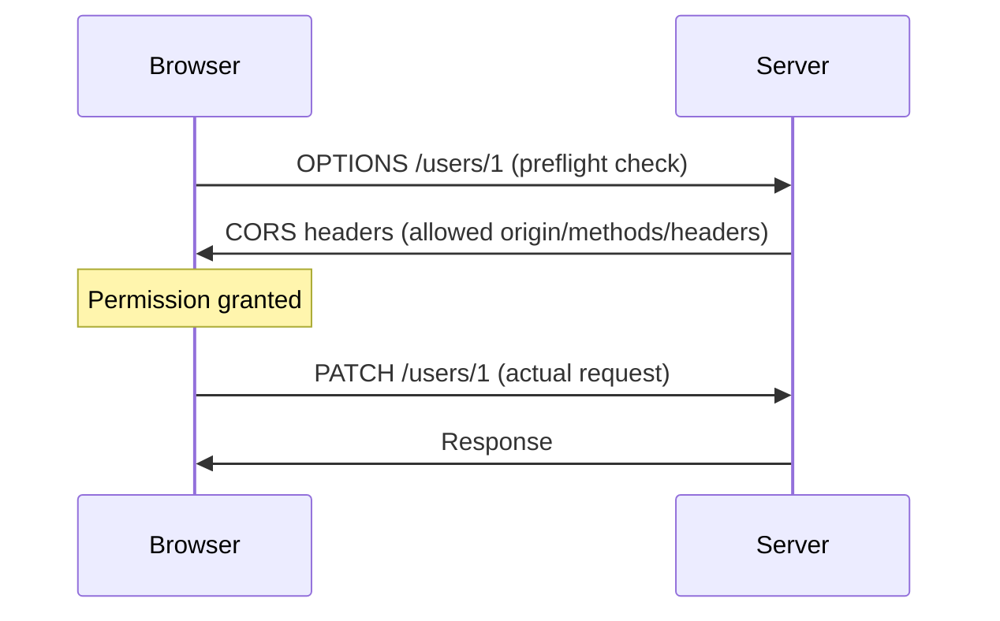

# CORS (Cross-Origin Resource Sharing)

## Concept
CORS is a **browser-enforced** security mechanism that controls whether
JavaScript running on one origin is allowed to read responses from a
different origin. It exists because browsers, by default, block
cross-origin reads to protect users (Same-Origin Policy).

## Why it matters
"It works in Postman but fails in the browser" is one of the most common
real debugging scenarios frontend developers hit — and it's entirely
explained by understanding that CORS is a *browser* rule, not a *server* or
*network* rule.

## What Counts as a Different Origin

An origin = **Protocol + Domain + Port**. If any one of these three differs,
it's a different origin.

```
https://example.com
vs
http://example.com          → different origin (protocol differs)

https://example.com
vs
https://api.example.com     → different origin (domain differs)

https://example.com:3000
vs
https://example.com:8080    → different origin (port differs)
```

## CORS Is Enforced by the Browser, Not the Server

```
Browser  → enforces Same-Origin Policy / CORS
Postman  → NOT a browser → does not enforce CORS rules
```

**This is why an API can work perfectly in Postman but throw a CORS error in
the browser console** — the server responded fine either way; it's the
browser choosing to block JavaScript from reading that response.

The server opts specific origins **in** via a response header:

```
Access-Control-Allow-Origin: https://myapp.com
```

## Preflight Requests

Not every cross-origin request triggers a preflight.

**Simple request — no preflight:**

```
Browser
  │
  ▼
GET /users
  │
  ▼
Server
  │
  ▼
Response
  │
  ▼
Browser checks CORS headers on the response
```

**Requests requiring preflight** (non-simple methods like `PUT`/`PATCH`/`DELETE`,
certain custom headers, or `Content-Type: application/json`):



**Important nuance:** even for a "simple" request with no preflight, the
browser still checks the CORS headers on the actual response — a server can
return a perfectly valid `200 OK`, but if `Access-Control-Allow-Origin` is
missing or doesn't match, the browser blocks JavaScript from reading the response body.

## Common interview questions
- Why does an API call work in Postman but fail in the browser with a CORS error?
- What three things determine whether two URLs share the same origin?
- What triggers a preflight `OPTIONS` request, and what doesn't?
- Does CORS prevent the request from reaching the server? (No — the request
  usually does reach the server and can execute; CORS only blocks the
  *browser* from letting JS read the response.)
- How would you fix a CORS error as a backend developer?
  (Add/correct `Access-Control-Allow-Origin` and related headers on the server response.)

!!! tip "Gotchas / follow-ups"
    - A very common misconception to correct explicitly: CORS is not a
      security feature that protects your *server* — it protects the
      *browser's user*, by preventing malicious sites from silently reading
      responses from other origins using the user's existing cookies/session.
    - `Access-Control-Allow-Origin: *` (wildcard) generally can't be combined
      with credentialed requests (cookies) — worth mentioning if the
      conversation goes into cookie-based cross-origin auth.
    - This directly follows from [Cookies, Sessions & JWT](cookies-and-auth.md)
      — cross-origin cookie handling adds another CORS layer
      (`Access-Control-Allow-Credentials`) worth knowing exists.

## Personal example
_(Add a real case — e.g. debugging a CORS error when your React dev server
on `localhost:3000` called a Spring Boot API on a different port, and how
you configured `@CrossOrigin` or a CORS filter to fix it.)_

## Related
- [REST API Design](rest-api-design.md)
- [Cookies, Sessions & JWT](cookies-and-auth.md)
