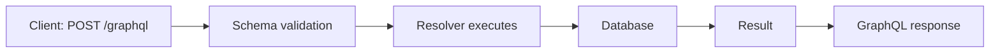

# GraphQL — Schema, Resolvers & the N+1 Problem

## Concept
GraphQL is a query language for APIs that lets the **client specify exactly
which fields it needs** in a single request — created partly to solve two
recurring REST problems: over-fetching and under-fetching.

## Why it matters
Knowing *what problem* GraphQL solves (not just "it's an alternative to
REST") is what interviewers actually want — plus the N+1 query problem is a
near-guaranteed follow-up for anyone claiming GraphQL experience, since it's
the most common real production performance issue with naive resolvers.

## The REST Problems GraphQL Solves

**Over-fetching** — getting more data than you need:

```
REST: GET /users/1

Server returns:
{ id, name, email, phone, address, dob, ... }

UI only needs: name, email
→ everything else is wasted bandwidth
```

**Under-fetching** — needing multiple round trips to get related data:

```
UI needs: user + orders + reviews

REST may require:
GET /users/1
GET /users/1/orders
GET /users/1/reviews
→ 3 separate network requests
```

**GraphQL's fix** — the client asks for precisely the shape it needs, in one request:

```graphql
query {
  user(id: 1) {
    name
    email
    orders {
      id
      amount
    }
  }
}
```

The server returns exactly those fields — nothing more, nothing less — and
GraphQL typically uses a **single endpoint** (`POST /graphql`), unlike REST's
many resource-specific endpoints.

## Schema — the API Contract

```graphql
type User {
  id: ID!
  name: String!
  email: String!
}

type Query {
  user(id: ID!): User
}
```

The schema describes available types, fields, queries, mutations, and
relationships — **it does not fetch data itself**.

```
Schema = Restaurant menu (describes what's available, doesn't cook the food)
```

## Resolvers — the Actual Data-Fetching Logic

A resolver is a function responsible for fetching one field's data.

```js
Query: {
  user(parent, args) {
    return db.users.findById(args.id);
  }
}
```



```
Schema   = Contract (what CAN be asked)
Resolver = Logic (HOW to get it)
Database = Where the data actually lives
```

**Nested resolvers** — each nested field can have its own resolver, resolved independently:

```graphql
query {
  user(id: 1) {
    name
    posts {
      title
    }
  }
}
```

```
User resolver → fetch user
      │
      ▼
Posts resolver → fetch posts for that user
      │
      ▼
Combine result → return JSON
```

## The N+1 Query Problem

If a query asks for a list of users AND each user's posts:

```graphql
query {
  users {
    name
    posts {
      title
    }
  }
}
```

**Naive implementation, with 100 users:**

```
1 query   → fetch 100 users

Then, naively, one resolver call PER user:
100 queries → posts for User 1
              posts for User 2
              ...
              posts for User 100

Total = 101 database queries  ("N+1": 1 for users, N for each user's posts)
```

This happens because each nested `posts` resolver independently queries the
database for its own user, with no awareness that 99 other identical
queries are about to run right alongside it.

**The standard fix — DataLoader (batching + per-request caching):**

Instead of firing a query per user immediately, a DataLoader **collects all
the pending user IDs during a single tick**, then issues **one batched
query** (`WHERE user_id IN (1, 2, 3, ..., 100)`) instead of 100 separate ones.

```
Without DataLoader:  101 queries (1 + N)
With DataLoader:       2 queries (1 for users, 1 batched for all posts)
```

## Common interview questions
- What problems does GraphQL solve that REST has? (Over-fetching, under-fetching.)
- What's the difference between a GraphQL schema and a resolver?
- Explain the N+1 query problem with a concrete example.
- How does DataLoader solve N+1? (Batching + per-request caching.)
- Does GraphQL use multiple endpoints like REST? (No — typically a single `/graphql` endpoint.)

!!! tip "Gotchas / follow-ups"
    - The N+1 problem isn't unique to GraphQL — it happens in any ORM/nested
      relationship fetching (Hibernate lazy loading has the exact same issue) —
      worth connecting this to your Spring Boot/JPA background if it comes up.
    - GraphQL trades REST's simplicity (cacheable GET URLs, HTTP status
      codes) for flexibility — a fair follow-up is "what does GraphQL make
      *harder* than REST?" (HTTP-level caching, file uploads, and simple
      monitoring/logging by URL all get more complex.)
    - DataLoader's caching is per-request by default — it doesn't replace a
      real application-level cache (like Redis) for data reused across different requests.

## Personal example
_(Add a real case — e.g. spotting or fixing an N+1 problem in a Hibernate/JPA
relationship in your Spring Boot backend — the concept is identical even
outside GraphQL.)_

## Related
- [REST API Design](rest-api-design.md)
