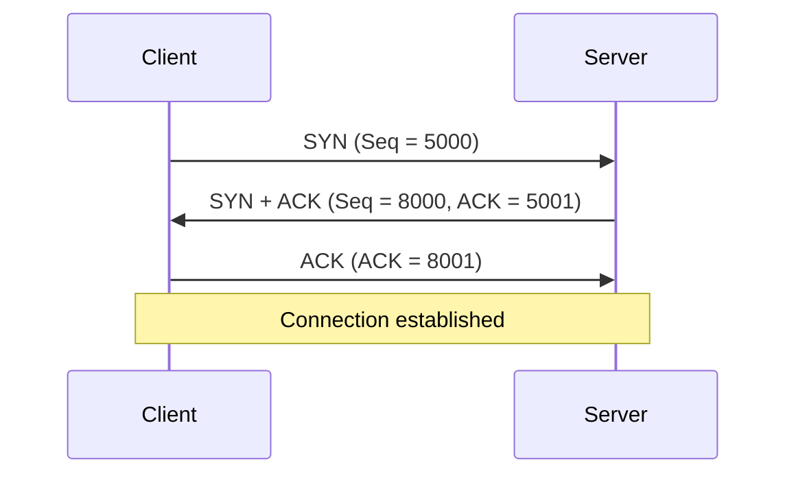
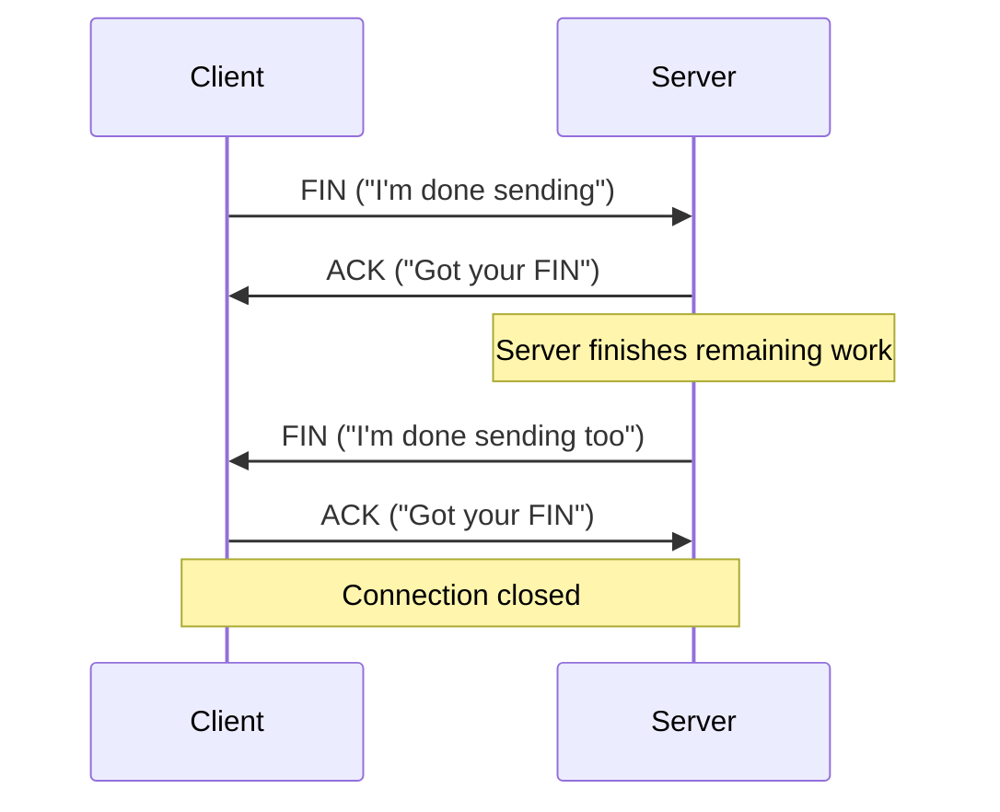

# TCP — Handshake, Reliability, Flow & Congestion Control

## Concept
TCP (Transmission Control Protocol) guarantees **reliable, ordered** delivery
of bytes between two machines. It doesn't know or care what those bytes mean
(that's HTTP's job) — it only cares that every byte arrives, in order, and
that sending/network capacity isn't overwhelmed.

## Why it matters
Nearly every "why does the internet work the way it does" interview thread
traces back to TCP — timeouts, retries, why HTTP/2 multiplexing was needed,
why UDP exists for latency-sensitive use cases. Understanding the mechanics
here (not just "TCP is reliable") is what separates a memorized answer from
a real one.

## 3-Way Handshake

Before any data flows, TCP establishes a connection so both sides agree on
starting sequence numbers.



**Why 3 steps, not 2?** Both sides need to confirm three things:
1. Client can reach server.
2. Server can reach client.
3. Both sides have synchronized starting sequence numbers.

## Sequence Numbers & ACKs

Sequence numbers identify the position of each byte in the stream.

```
Client sends 100 bytes:
Seq = 5001, Length = 100

Server receives bytes 5001–5100

Server responds:
ACK = 5101
```

**Key rule:** `ACK = next byte expected`, not "last byte received."

```
Memory aid:
Sequence Number → MY data
ACK Number      → YOUR next expected byte
```

## Packet Loss & Retransmission

```
Seq 1001 (100 bytes) → received  ✓
Seq 1101 (100 bytes) → LOST      ✗
Seq 1201 (100 bytes) → received  ✓

Server keeps sending: ACK = 1101
("I'm still waiting for byte 1101 — everything after it is buffered but unusable until this arrives")

Once 1101 is retransmitted and received:
Server can now ACK = 1301 (everything up to 1300 confirmed)
```

TCP guarantees the *application* never sees segment 3 before segment 2 —
even if segment 3 physically arrived first over the network.

## Flow Control (Receive Window)

**Problem:** a fast sender can overwhelm a slow receiver's buffer.

```
Fast sender → Slow receiver → Buffer fills → Potential packet loss
```

**Solution:** the receiver advertises a **receive window (rwnd)** — "how much
more data I can currently accept."

```
Window = 300 bytes
Client can send: 100 + 100 + 100 bytes, then must wait

Server later sends:
ACK = 1301, Window = 500
("I got your data, and now I have room for 500 more bytes")
```

The window represents the **receiver's** capacity — not the sender's, and
not the network's.

## Congestion Control (Congestion Window)

Flow control and congestion control solve **different** problems:

| | Protects |
|---|---|
| Flow Control | The **receiver** (don't overwhelm its buffer) |
| Congestion Control | The **network** (don't overwhelm shared infrastructure) |

```
Effective send limit = min(rwnd, cwnd)

rwnd = receiver's capacity
cwnd = network's current capacity/condition
```

**Slow Start** — TCP ramps up cautiously, testing the network's limits:

```
1 segment → 2 → 4 → 8 → 16 → ... → packet loss detected
                                          ↓
                              reduce sending rate,
                              increase again more carefully
```

```
Memory aid:
rwnd → R = Receiver
cwnd → C = Congestion
```

## Connection Termination (4-Way)

TCP is **full-duplex** — each side closes its own sending direction independently.



**Why 4 steps instead of 3?** The server may receive the client's FIN but
still have data left to send — so it can't send its own FIN immediately; it
ACKs first, finishes its work, then sends its own FIN separately.

## Common interview questions
- Walk me through the TCP 3-way handshake and explain why each step is necessary.
- What does an ACK number actually represent?
- Difference between flow control and congestion control?
- Why does TCP connection termination take 4 steps instead of 3, unlike the handshake?
- What happens when a TCP segment is lost mid-transmission?

!!! tip "Gotchas / follow-ups"
    - `min(rwnd, cwnd)` is a very commonly tested detail — many candidates
      only know one of the two windows exists.
    - Slow Start's exponential ramp-up, followed by a backoff on loss, is the
      classic "TCP sawtooth" graph — worth being able to sketch if asked to go deeper.
    - This is the layer HTTP/1.1's head-of-line blocking problem and HTTP/2's
      multiplexing fix both build on top of — good bridge if the conversation moves to HTTP.

## Personal example
_(Add a real case — e.g. debugging a slow API call that turned out to be
receive-window-limited on a constrained mobile network in your React Native app.)_

## Related
- [Networking Foundations & DNS](networking-foundations.md)
- [TLS / HTTPS](tls-https.md)
